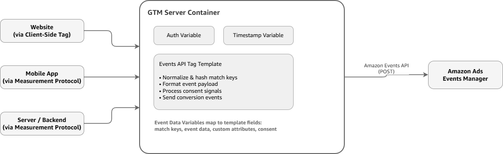

# Amazon Events API (CAPI v2) Server-Side Template for Google Tag Manager

Imagine you're an advertiser running Sponsored Ads and DSP campaigns across multiple channels. You've got conversion tracking set up with the Amazon Ad Tag on your website, but you're starting to hit the limits of client-side tracking: browser privacy features are blocking pixels, iOS users aren't converting in your reports, and ad blockers are preventing conversion data from reaching Amazon.

This is the reality for most advertisers relying on client-side conversion tracking today, and it creates real problems:

- **Data Loss**: Ad blockers, browser privacy settings, and consent frameworks block client-side tags, leading to incomplete conversion data and underreported ROAS.
- **Reliability Issues**: Once data leaves the browser, you have no control — network failures, script blockers, and browser extensions can prevent conversions from reaching Amazon.
- **Privacy Compliance Complexity**: Managing consent across TCF, GPP, and Amazon's frameworks in client-side JavaScript requires careful coordination and is prone to implementation errors.

What if you could move conversion tracking to a secure server environment where data delivery is guaranteed, privacy compliance is built-in, and you maintain full control over the conversion pipeline?

## The Solution

The Amazon Events API Google Tag Manager server-side template collection allows you to implement Amazon Events API (Conversions API v2) using Google Tag Manager's server-side capabilities. This solution moves conversion tracking off the browser and into a controlled server environment, providing comprehensive event tracking and conversion attribution for Amazon Advertising.

The template incorporates best practices for server-side tracking and delivers reliable conversion data to Amazon Advertising.

### Why Server-Side?

Server-side tagging moves data collection from the user's browser to a secure server environment. This provides:

- **Direct server-to-server integration** with Amazon Events API endpoints, improving data reliability and eliminating client-side blocking
- **Greater control over data** before it's sent to advertising platforms — validate, normalize, and enrich conversion data in a controlled environment
- **Built-in privacy compliance** with support for TCF v2.0, GPP, and Amazon Consent frameworks

### Who Is This For?

This solution is designed for advertisers, agencies, and tech partners who:

- Use or plan to use Amazon DSP for advertising
- Want to send conversion events to Amazon Ads via server-side Google Tag Manager
- Need reliable, privacy-compliant conversion attribution
- Require control over conversion data quality and delivery

## Architecture

The template supports multiple event sources — websites via client-side tags, mobile apps, and server/backend systems via Measurement Protocol — all flowing into a GTM server container where the Events API templates handle authentication, data formatting, and delivery to Amazon Ads Events Manager.

For details on how to send data to a GTM server container from different sources, see Google's [Send data to server-side Tag Manager](https://developers.google.com/tag-platform/tag-manager/server-side/send-data) guide.

## Template Components

The solution is packaged as three Google Tag Manager templates that work together to authenticate, format, and send conversion events to Amazon Ads.

### Amazon Events API Tag Template

**File**: `Amazon_Events_API_Tag_Template.tpl`

The main tag template that sends conversion events to Amazon's Events Manager Platform in the DSP. It handles OAuth authentication, data normalization, PII hashing, consent processing, and event delivery.

**Supported Conversion Types**:

| Conversion Type | Description | Value Type |
|---|---|---|
| Add to shopping cart | When customers add a product to their shopping cart | non-monetary |
| Application | When customers submit an application | non-monetary |
| Checkout | When customers go to the checkout page | non-monetary |
| Contact | When customers provide contact information, such as email, phone number, etc. | non-monetary |
| Lead | When customers perform an action that initiates a sales lead | non-monetary |
| Off-Amazon purchase | When customers make a purchase for a service or product | monetary (e.g. 4.99) |
| Page View | When customers visit a page on your website | non-monetary |
| Search | When customers perform a search for a product | non-monetary |
| Sign-up | When customers sign up for a product or service | non-monetary |
| Subscribe | When customers sign up for your service | non-monetary |
| Mobile app first start | When customers launch the downloaded app for the first time | non-monetary |
| Other | Customer actions that don't fit the definition of the standard conversion types | non-monetary |

### Amazon CAPI Auth Variable

**File**: `Amazon_CAPI_Auth_Variable.tpl`

A variable template that handles OAuth authentication with Amazon Ads API, including automatic token refresh and caching. The variable manages the full OAuth lifecycle — generating access tokens, caching them for 55 minutes with a 5-minute buffer, and automatically refreshing before expiration.

### Amazon CAPI Timestamp Variable

**File**: `Amazon_CAPI_Timestamp_Variable.tpl`

A utility variable that converts epoch milliseconds to ISO-8601 format timestamps required by the Amazon Events API. Since GTM's sandboxed JavaScript environment doesn't provide access to the standard `Date` object, this variable reimplements timestamp conversion from scratch using manual epoch math.

## Key Features

The template collection is designed to simplify server-side conversion tracking while giving you full control over data quality, privacy compliance, and event attribution.

- **Server-to-Server Integration**: Direct integration with Amazon Events API endpoints eliminates client-side blocking and ensures reliable data delivery
- **Multi-Region Support**: Supports North America, Europe, and Far East API regions
- **Automatic Data Processing**: Smart normalization and SHA-256 hashing of match keys with pass-through for already hashed values — you can send raw PII or pre-hashed data
- **Comprehensive Match Keys**: Supports email, phone, mobile ad IDs (ADID/IDFA/FIREADID), personal information (first name, last name, address, city, state, postal), LiveRamp IDs (RAMP_ID), and Match IDs (MATCH_ID)
- **Privacy Compliance**: Built-in support for TCF v2.0, GPP, and Amazon Consent frameworks — select one consent method per implementation
- **Custom Attributes**: Flexible custom data collection with multiple data types (`STRING`, `INTEGER`, `TIMESTAMP`) — name your own attributes beyond the standard brand, productId, and category fields
- **Token Management**: Automatic OAuth token refresh and caching — no manual token management required
- **Event Deduplication**: Built-in eventId support for preventing event duplication across Amazon Ad Tag and Events API sources
- **Dataset Organization**: Support for organizing events into named datasets for better reporting and organization
- **User-Friendly Interface**: Enhanced template parameters with examples, conditional fields, and clear guidance

## Real-World Scenario: E-Commerce Holiday Campaign

Let's walk through how an e-commerce advertiser would use this solution for their Black Friday campaign.

**The Setup**: An online electronics retailer is launching a Black Friday campaign for premium noise-canceling headphones. They want to track purchases, add-to-cart events, and page views — and they need accurate conversion attribution despite high ad blocker usage during the holiday shopping season.

**The Flow**:

1. A customer clicks a Sponsored Products ad and lands on the product page
2. The customer adds headphones to their cart — the website's GTM web container captures the event with the customer's hashed email, the product ID, and the cart value
3. The web container forwards the event to the GTM server container
4. The Amazon Events API tag fires:
   - The Auth Variable retrieves a cached OAuth token (or refreshes it if expired)
   - The Timestamp Variable formats the current time as `2026-11-29T18:45:30Z`
   - The tag normalizes and hashes the customer's email (if not already hashed)
   - The tag processes the customer's consent signals
   - The tag sends the conversion event to Amazon Events API with all match keys, event data, and custom attributes
5. The event lands in Amazon Ads Events Manager
6. Amazon matches the hashed email against its audience signals and attributes the conversion back to the Sponsored Products ad

**The Result**: The advertiser gets accurate, privacy-compliant conversion attribution even for users with ad blockers enabled. The server-side pipeline guarantees delivery, and the automatic consent processing ensures users are handled correctly without manual intervention.

---

Before you begin, make sure you have everything in place. See [Prerequisites](../prerequisites/prerequisites.md).
